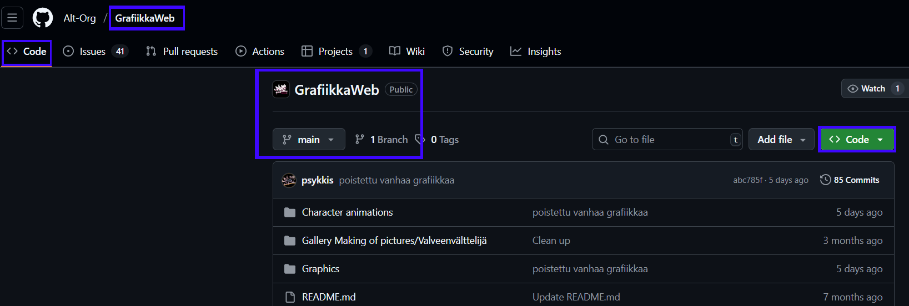
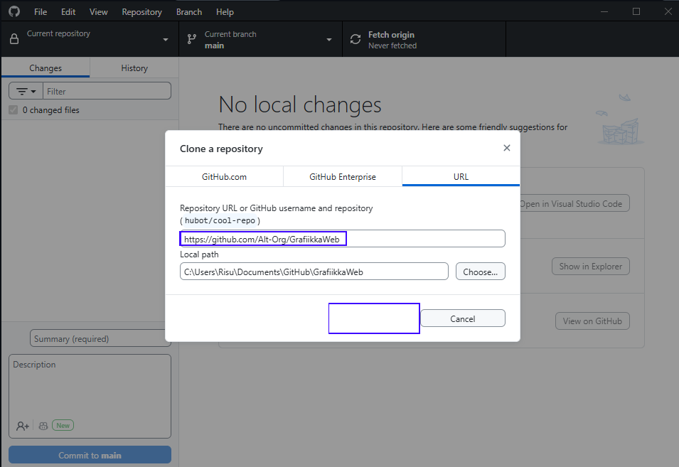
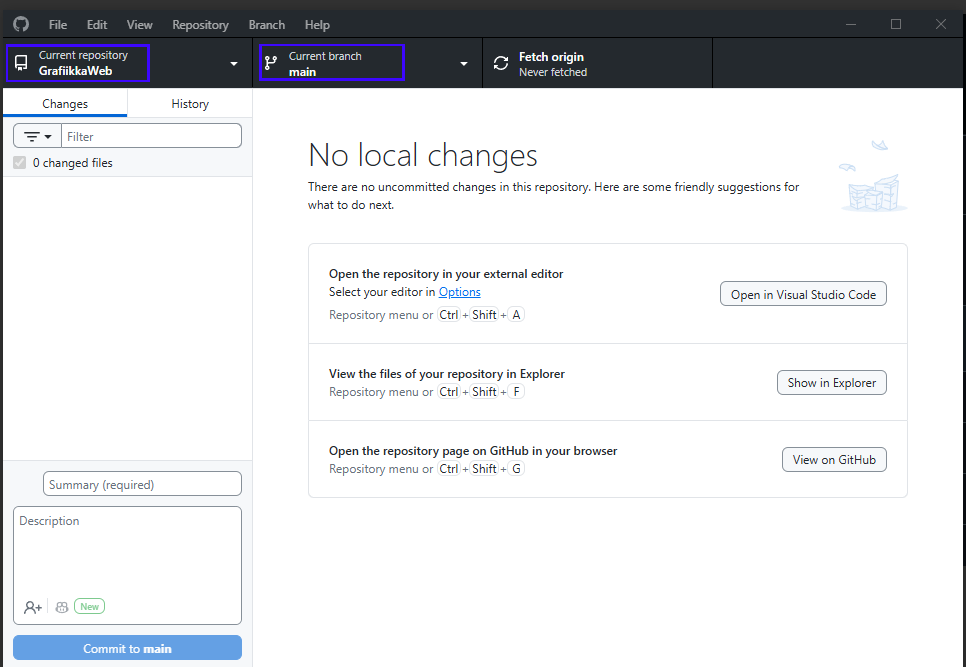
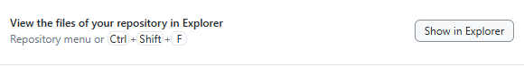
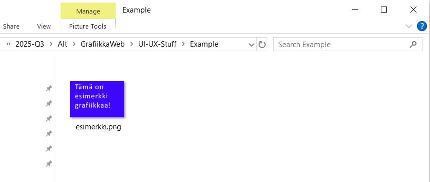
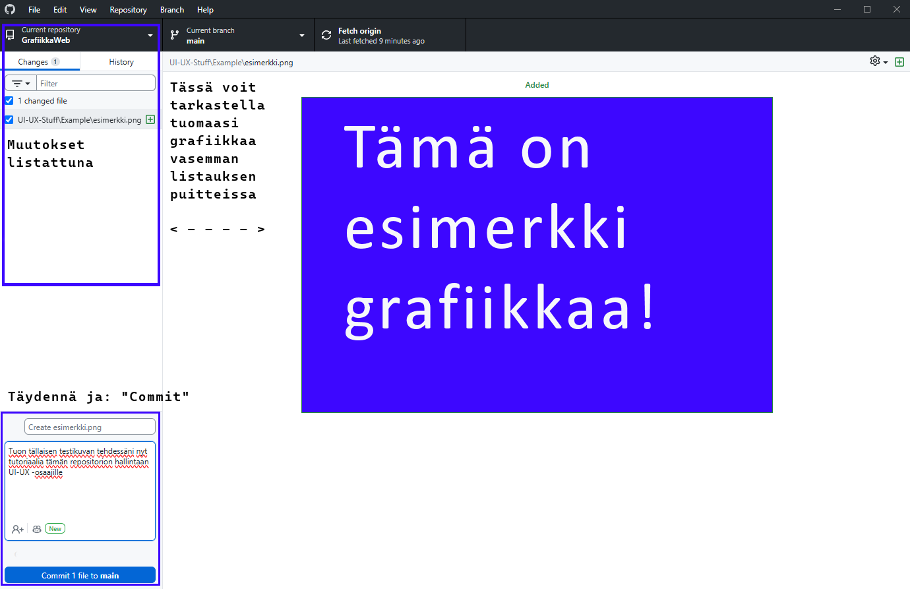

## Welcome to the **GrafiikkaWeb** repository! 🎨  

This is the dedicated space for managing and collaborating on the **Alt Zone graphic assets and web design elements**. 

Together, we ensure a cohesive and visually compelling experience for the Alt Zone web project.  

---

## 🌟 What is GrafiikkaWeb?  
GrafiikkaWeb serves as the repository for all graphic-related resources, including images, UI components, and layout designs used for the **Alt Zone website**. 

This repository supports and complements the work being done in the Alt Zone WebPages repository.  

---

## 📁 Resources and Tools  

### **Figma Designs**  
All visual design work is created and organized in Figma. Access the designs [here](https://www.figma.com/design/qaRrNbozqOeESL9lQ2UDrM/Altzone?node-id=0-1&t=3qbWOs48Urrpnk1Y-1) to contribute or review the graphical assets.  

### **Project Wiki**  
Explore the GrafiikkaWeb Wiki for detailed guidelines, asset organization, and collaboration tips. You can find the Wiki [here](https://github.com/Alt-Org/GrafiikkaWeb/wiki).  

---

## 🤝 Get Involved!  
Whether you’re designing, organizing, or implementing assets, your contributions are key to the success of the Alt Zone project.  

If you need help or have questions, reach out to the team on Discord. Let’s build something extraordinary together! 🚀  

---

## FIN Käyttöohjeet repoon

- Aloita luomalla tili GitHubiin, jos ei vielä ole.
- Lataa ja ota käyttöön [Github Desktop](https://github.com/apps/desktop) -sovellus. 
- Tarvitset käyttöoikeudet tähän repositorioon tehdäksesi muutoksia. Pyydä niitä tässä vaiheessa Discrodissa.
  - Seuraavaksi vaihe vaiheelta kloonaat GrafiikkaWeb -repositorion paikalliseen työhakemistoosi Github Desktopin avulla. 
  - Tämä on kertaluontoinen prosessi per. työkone ja per. repositorio.
  - UI/UX -osaajat käyttävät tätä yhtä repositoriota.

- Klikkaa "Code" -painiketta avataksesi lisävalikon

- Tarkista, että URL on oikea ja valitse vaihtoehto "Open with GitHub Desktop"

- GitHub Desktop -sovellukseen aukeaa ikkuna
  - varmenna, että URL on oikein sekä kun paikallinen työhakemisto (Local path) on haluamasi, niin paina Clone.

- GitHub Desktop -sovelluksesi näkymä tässä repositoriossa on tällainen
  - Current repository = GrafiikkaWeb
  - Current branch = main
  - Fetch origin -painike hakee uusimmat muutokset: paina tätä aina ensin silloin, kun olet aloittamassa tiedostojesi siirtämistä!

## Nämä vaiheet jatkossa aina, kun tuot tiedostoja gittiin

- Muista edellisen vaiheen "Fetch Origin" aloittaessasi

- Kun tuot tiedostoja repositorioon, klikkaa "Show in Explorer" keskeltä näkymää
  - Se avaa paikallisen työhakemiston uuteen ikkunaan
  - Siirrä sen avulla kohdekansioihin tarvittavat tiedostot

- Siirrettyäsi haluamasi tiedostot mukaan, päivittyy samalla GitHub Desktop -sovelluksen näkymä
  - "Changes" -kohdassa on listattu tuomasi & muuttamasi asiat sekä voit tarkastella niitä yksitellen sovelluksen keskinäkymässä
  - Kuvaile "Description" -kohdassa lyhyesti, mitä olet tuomassa tai tekemässä
  - Kun olet valmis, klikkaa alareunassa olevaa painiketta "Commit ... to main"

